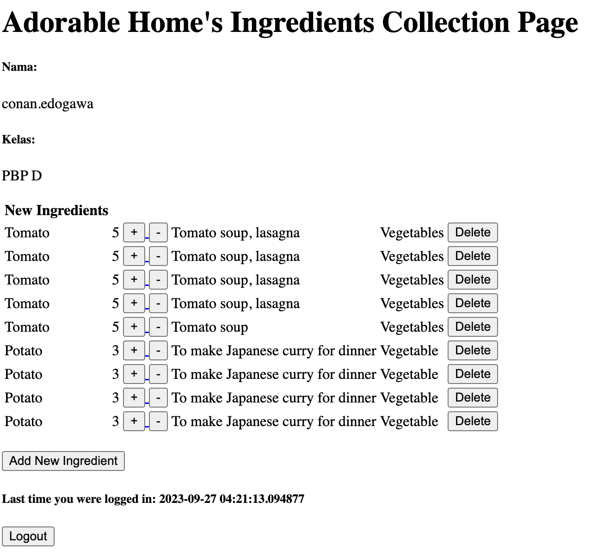
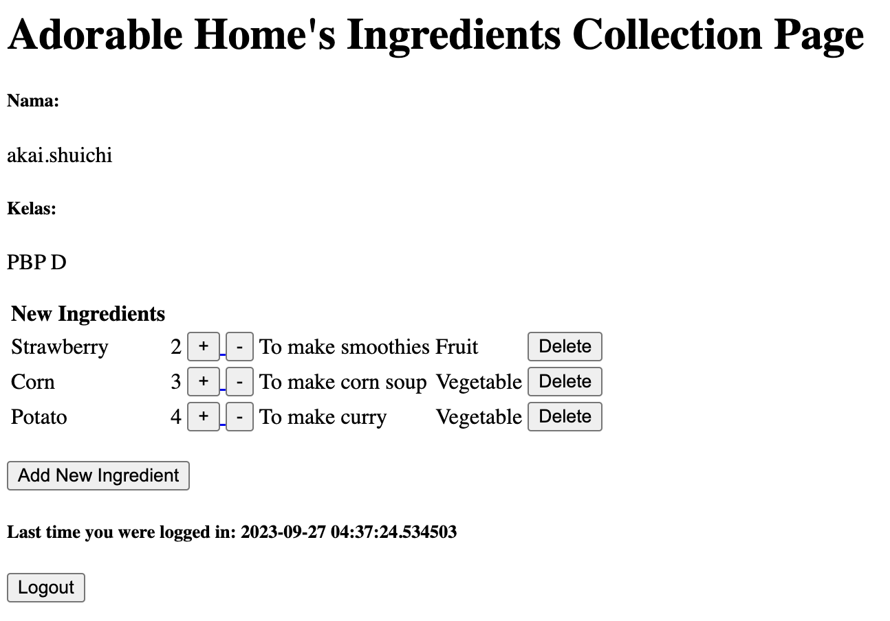
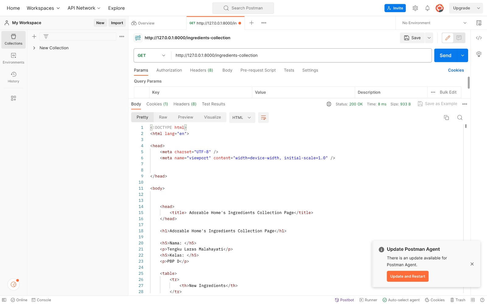

[Link Adaptable](https://ingredients-collection-app.adaptable.app/main/) tidak bisa diakses karena akun Adaptable saya di-disabled 
[Link Deploy]()
# Tugas 6 PBP
# Perbedaan antara *Asynchronous Programming* dengan *Synhcronous Programming*
* Perbedaan antara kedua konsep *programming* tersebut terletak pada cara kerjanya. *Asynchronous programming* bekerja secara independen dan tidak terkait dengan eksekusi lain yang dijalankan. Ketika suatu perintah dieksekusi, perintah lain yang dieksekusi setelahnya tetap dapat berjalan. Hal ini memungkinkan program bekerja dalam waktu yang lebih singkat. Pengguna juga dapat menjalankan banyak *task* secara bersamaan, sehingga dapat disimpulkan bahwa *asynchronous programming* bekerja secara paralel. Sementara itu, *synchronous programming* bekerja secara satu per satu secara sekuensial sesuai dengan urutan suatu perintah harus dijalankan. Ketika suatu perintah dieksekusi, perintah-perintah yang akan dieksekusi setelahnya harus menunggu perintah tersebut selesai dieksekusi. Pengguna hanya dapat menjalankan *one task at a time*, sehingga dapat disimpulkan bahwa *synchronous programming tidak bekerja secara paralel. Hal ini membuat alur program lebih mudah dipahami, tetapi dijalankan dalam waktu yang lebih lama dibandingkan dengan *asynchronous programming*.
# Penjelasan Paradigma *Event-driven Programming* beserta Contohnya di Tugas Ini
* Paradigma *Event-driven Programming* merujuk pada konsep waktu eksekusi *task* yang ditentukan oleh suatu *event* tertentu. Program dengan *event-driven programming* juga memungkinkan program bekerja secara *asynchronous*. Dalam *event-driven programming*, terdapat *event-listener* dan *event-handler* yang masing-masing bekerja untuk "mendengarkan" kapan suatu *event* akan terjadi dan mengatur respon apa yang harus diberikan ketika *event* tersebut terjadi.
* Penerapan *event-driven programming* pada tugas ini terletak pada
# Penjelasan Penerapan *Asynchronous Programming* pada AJAX
AJAX merupakan singkatan dari *Asynchronous* JavaScript And XML, yang berarti bahwa AJAX bekerja secara *asynchronous* (menerapkan *asynchronous programming*). Dengan cara kerja ini, berbagai *event* dapat dijalankan oleh AJAX secara paralel. Cara kerja ini ditandai dengan kata kunci `async`. Selain itu, terdapat juga fungsi `fetch()` yang melakukan proses HTTP GET Request dan Await agar memastikan bahwa *task* yang akan dijalankan di program lainnya tetap dapat berjalan. Ketika sudah terdapat respon yang menandakan bahwa *task* sudah selesai dieksekusi, fungsi-fungsi lain dalam program akan dijalankan.
# Perbandingan Fetch API dan *Library* jQuery
| Fetch API| jQuery|
| -- | -- |
| Tidak memerlukan *library* tambahan | Memerlukan *library* tambahan yang perlu diunduh |
| Lebih sering digunakan di aplikasi web modern karena mudah digunakan | *Compatible* untuk semua aplikasi web karena memiliki fitur dan utilitas yang banyak |
| Memnggunakan *syntax* yang lebih mudah dipahami | Menggunakan *syntax* yang lebih sulit dipahami

Menurut saya, keduanya sama-sama memiliki kekurangan dan kelebihan masing-masing. Penggunaannya tergantung pada pekerjaan yang akan kita lakukan. Misalnya, tugas ini lebih cocok dikerjakan dengan Fetch API karena lebih mudah dimengerti dan *beginner-friendly*. Akan tetapi, untuk projek lain yang lebih besar yang mengharuskan kita membuat sebuah aplikasi web yang *compatible* di semua browser, sebaiknya kita menggunakan *library* jQuery.
# Penjelasan Implementasi Checklist
## Implementasi AJAX GET
Saya membuat fungsi `get_item_json` yang dapat mengembalikan data dalam bentuk JSON yang dapat di-*fetch* pada `main.html`.
```
def get_item_json(request):
    data = Item.objects.filter(user=request.user)
    return HttpResponse(serializers.serialize('json', data))
```
Saya juga membuat fungsi `add_item_ajax` yang berfungsi untuk menambahkan data yang ditambahkan pengguna melalui AJAX ke basis data. Fungsi ini menggunakan dekorator `@csrf_exempt` untuk memberitahu bahwa fungsi ini tidak memerlukan token CSRF.
```
@csrf_exempt
def add_item_ajax(request):
    if request.method == 'POST':
        user = request.user
        name = request.POST.get("name")
        category = request.POST.get("category")
        amount = request.POST.get("amount")
        description = request.POST.get("amount")

        new_item = Item(user=user, name=name, category=category, amount=amount, description=description)
        new_item.save()
        return HttpResponse(b"CREATED", status = 201)
    return HttpResponseNotFound()
```
Setelah itu, saya menambahkan URL *path* dari fungsi-fungsi tersebut di `urls.py`.
```
path('get-product/', get_item_json, name='get_item_json'),
path('create-ajax/', add_item_ajax, name='add_item_ajax'),
```
## Implementasi AJAX POST
Agar pengguna dapat menambahkan bahan makanan baru di *form* dengan AJAX, saya membuat sebuah tombol `Add Ingredient by AJAX`. Saat memencet tombol ini, pengguna dapat menambahkan bahan makanan baru sekaligus melihat perubahan yang terjadi di inventori secara *asynchronous*. Saya juga menambahkan fungsi `addItem()` yang berfungsi untuk melakukan *fetch* dan mengirimkan HTTP Request.
## Melakukan Perintah `collectstatic`
Saya menambahkan kode berikut ini pada berkas `settings.py`:
```
STATIC_ROOT = os.path.join(BASE_DIR, 'static')
```
Kemudian, perintah `python manage.py collectstatic` saya jalankan di terminal untuk mengumpulkan setiap *static file* di kode saya.

------------------------------------------------------------------------------------------------------------------------------------------
# Tugas 5 PBP
# Manfaat dari Setiap HTML *Element Selector* dan Waktu Kegunaannya
1. **`Element Selector`** (tidak diawali # atau .)
* *Selector* ini berfungsi untuk memilih elemen HTML berdasarkan *tag*-nya. *Selector* ini dapat kita gunakan ketika kita ingin memilih properti dari elemen-elemen yang memiliki *tag* yang sama. Dengan adanya `element selector`, kita dapat menerapkan sifat-sifat/ciri-ciri yang sama pada semua elemen dengan *tag* yang kita pilih.
* Format penulisan `element selector` pada CSS adalah: **`[nama_tag]{ ... }`**
* Contoh penggunaan `element selector` adalah sebagai berikut:
```
p{
  font-size: 20 px;
  color: #FF0000;
}
```
* *Selector* `p` akan memilih semua elemen teks pada HTML, sehingga semua elemen teks di HTML kita akan berukuran 20 pixel dan berwarna merah.

2. **`Class Selector`** (diawali .)
* *Selector* ini berfungsi untuk memilih elemen HTML berdasarkan *class*-nya. *Selector* ini dapat kita gunakan ketika kita ingin memilih properti dari elemen-elemen yang termasuk dalam *class* yang sama. Dengan adanya `class selector`, kita dapat menerapkan sifat-sifat/ciri-ciri yang sama pada semua elemen dengan *class* yang kita pilih.
* Format penulisan `class selector` pada CSS adalah: **`.[nama_class]{ ... }`**
* Contoh penggunaan `class selector` adalah sebagai berikut:
```
.card_design{
  color: #FF0000;
  font-size: 20 px;
}
```
* *Selector* `card_design` akan memilih semua elemen pada HTML yang termasuk dalam *class* `card_design`, sehingga semuanya akan berukuran 20 pixel dan berwarna merah.
3. **`ID Selector`** (diawali #)
* *Selector* ini berfungsi untuk memilih suatu elemen tertentu di HTML berdasarkan ID-nya. Karena ID HTML bersifat unik untuk setiap elemen, kita dapat menggunakan `ID selector` untuk menerapkan sifat-sifat/ciri-ciri tertentu.
* Format penulisan `ID selector` pada CSS adalah: **`#[nama_ID]{ ... }`**
* Contoh penggunaan `ID selector` adalah sebagai berikut:
```
#header{
  background-color: #FFFFFF;
  text-align: center;
  color: black;
}
```
* *Selector* `header` akan mengatur elemen yang memiliki ID `header` sehingga *header* di HTML tersebut akan memiliki warna latar belakang putih, *centered text align*, dan warna teks hitam.
# Penjelasan Tentang HTML5 Tag yang Saya Ketahui
- `<!-- -->`: digunakan untuk memberikan komentar pada HTML
- `<body>`: digunakan untuk menandakan bagian yang menjadi badan dari dokumen HTML
- `<button>`: digunakan untuk menandakan tombol yang dapat kita pencet
- `<div>`: digunakan untuk menamdakan suatu bagian dari badan dokumen HTML
- `<head>`: digunakan untuk memberikan informasi terkait suatu dokumen HTML
- `<title>`: digunakan untuk menandakan judul (*title*) dari suatu dokumen HTML
# Perbedaan *Margin* dan *Padding*
* *Margin* adalah area di sekitar batas (*border*) suatu elemen pada HTML. Oleh karena itu, *margin* mengatur area di luar suatu elemen. Sementara itu, *padding* adalah area yang berada di antara batas suatu elemen dengan isi (*content*) dari suatu elemen pada HTML. Oleh karena itu, *padding* mengatur area di dalam elemen. Berikut adalah ilustrasi perbedaan dari *margin* dan *padding*:

# Perbedaan antara *Framework* CSS Tailwind dan Bootstrap dan Kapan Waktu Penggunaannya?
Tailwind dan Bootstrap adalah *framework* CSS yang banyak digunakan oleh pengembang aplikasi web. Perbedaan dari kedua *framework* tersebut adalah Bootstrap telah menyediakan komponen-komponen CSS seperti *template* dan *class* yang siap pakai sehingga pengembang tidak perlu mengatur kode untuk membuat komponen-komponen *basic* di aplikasi web mereka. Sementara itu, Tailwind tidak menyediakan komponen yang siap pakai. Pengembang pun harus merancang dan membangun desain mereka dengan menggunakan *utility classes* yang telah disediakan. Keunggulan dari perbedaan ini adalah pengembang dapat menghemat waktu saat membangun aplikasi web mereka dengan menggunakan Bootstrap karena komponen-komponen umum telah tersedia. Hal ini juga membuat Bootstrap unggul dalam kecepatan implementasi dibandingkan Tailwind. Akan tetapi, Tailwind tentu saja lebih unggul dalam hal kustomisasi dibandingkan dengan Bootstrap. Oleh karena itu, dapat kita simpulkan bahwa Bootstrap berfokus pada pengembangan komponen CSS secara umum dan menyeluruh untuk aplikasi web, sementara Tailwind berfokus pada tampilan *User Interface* (UI) yang fleksibel. 

Waktu yang baik untuk menggunakan Bootstrap adalah ketika pengembang akan membuat sebuah aplikasi web dalam jangka waktu yang pendek, tetapi tetap ingin menghasilkan aplikasi web yang fungsional dan praktis. Sementara itu, ketika pengguna akan membuat sebuah aplikasi web dalam jangka waktu yang panjang dan ingin menghasilkan aplikasi web dengan desain yang kompleks (hasil kustomisasi), ia dapat menggunakan Tailwind. 

# Penjelasan Implementasi Checklist
## Kustomisasi Desain pada *Template* HTML yang Telah Dibuat pada Tugas 4 dengan Menggunakan CSS atau CSS *Framework*
### Checklist 1: Kustomisasi Halaman Login
Saya mendesain halaman `login` di aplikasi web saya dengan menggunakan Bootstrap. Pada *file* `login.html`, saya mengatur *background image* tampilan aplikasi web saya di *class* `bg-image` dengan gambar dapur di *game* Adorable Home (dapurnya desain sendiri hehe 😎). Kemudian saya membuat *class* `overlay` agar konten (*form login*) pada halaman login dapat terlihat dengan jelas dan tidak tertutup oleh *background image* yang cerah (*making content more readable against light background*). Selanjutnya, saya membuat *class* yang berisi konten dari *form login*. *Class* tersebut mengatur posisi *form* agar berada di bagian tengah layar dan z-index yang mengatur urutan *stack* dari suatu elemen (*form login*) agar tidak tertumpuk.
### Checklist 2 & 3: Kustomisasi Halaman Register dan Tambah Inventori
Halaman `register`, `login`, dan `tambah inventori` memiliki tampilan yang serupa. Perbedaannya hanya terletak pada teks pada *form register* dan *add an ingredient*.
## Checklist 4: Kustomisasi Halaman Daftar Inventori dengan Menggunakan `Card`
Desain halaman daftar inventori berbeda dengan halaman login, register, dan tambah inventori. Pada halaman daftar inventori, saya tidak menambahkan *background image* karena saya ingin pengguna dapat berfokus pada daftar bahan makanan yang telah mereka daftarkan di aplikasi web saya. Saya menggunakan class `card` untuk mendesain halaman daftar inventori. Mengapa? Karena saya ingin daftar inventori bahan makanan terletak pada satu bagian yang sama (tidak terpisah-pisah dalam sebuah *container*) dengan tetap menyesuaikan ukuran layar. Selain itu, saya ingin *container*nya juga fleksibel dan *extensible*. Pengaturan `Card` yang saya gunakan dapat dilihat pada berkas `main.html` di *folder* `main`.

------------------------------------------------------------------------------------------------------------------------------------------ 
# Tugas 4 PBP
# Django `UserCreationForm` serta Kelebihan dan Kekurangannya
* Django memiliki sebuah * build-in user-authentication system*, yaitu sebuah sistem yang dapat melakukan verifikasi terhadap identitas pengguna sehingga pengguna yang terverifikasi akan mendapatkan akses untuk menjalankan suatu kegiatan tertentu yang diperbolehkan di sistem tersebut. *User-authentication system* pada Django mengatur hal-hal yang berkaitan dengan *user accounts* (akun pengguna), *groups* (memberikan izin untuk lebih dari satu pengguna), *permissions* (memberikan akses kepada pengguna terkait kegiatan apa saja yang diperbolehkan), dan *cookie-based user sessions* (menggunakan *cookies* untuk mengenali *session* yang unik pada suatu web tertentu). Salah satu *modules* Django yang berkaitan dengan sistem tersebut adalah `UserCreationForm`.
* Modul `UserCreationForm` digunakan untuk membuat sebuah *user* baru di aplikasi web kita. Ketika *user* melakukan registrasi akun baru di aplikasi web kita, `UserCreationForm` mengatur atribut `username`, `password1`, dan `password2` (untuk konfirmasi password1). Tampilan *form* aplikasi web kita akan berbentuk seperti ini:

* Kelebihan modul `UserCreationForm` adalah pengembang aplikasi web tidak perlu membuat kode untuk membuat *form* karena sudah siap digunakan di modulnya. Selain itu, tampilan *form* nya juga bisa dimodifikasi untuk disesuaikan dengan keinginan pengembang. Selain itu, modulnya juga terhubung dengan sistem autentikasi dan otorisasi pada Django, sehingga memudahkan pengembang dalam proses pembuatan aplikasi webnya.
* Kekurangan modul `UserCreationForm` adalah pengembang harus menambahkan atribut-atribut tambahan untuk memenuhi kebutuhan aplikasi web yang kompleks karena modul tersebut hanya berperan untuk pembuatan *form* yang dasar.  Selain itu, tampilan bawaan dari modul `UserCreationForm` mungkin tidak sesuai dengan desain atau gaya tampilan yang diinginkan pengembang, sehingga memerlukan pekerjaan ekstra untuk menyesuaikannya.
# Perbedaan antara Autentikasi dan Otorisasi dalam Konteks Django dan Mengapa Keduanya Penting?
* Django memiliki sebuah *build-in user-authentication system* yang dapat memverifikasi identitas pengguna (autentikasi) dan menentukan akses kegiatan yang dapat dilakukan suatu pengguna (otorisasi).
* Autentikasi dalam Django adalah sebuah proses verifikasi identitas pengguna yang mencoba mengakses aplikasi web. Autentikasi memastikan bahwa pengguna yang sedang mengakses aplikasi web adalah pengguna yang terverifikasi dan diperbolehkan untuk mengaksesnya.
* Otorisasi dalam Django adalah sebuah proses verifikasi akses yang diperbolehkan untuk pengguna yang sedang mengakses aplikasi web. Otorisasi menentukan kegiatan apa saja yang diperbolehkan dan dilarang dilakukan oleh pengguna setelah mereka *login*. Hal ini memungkinkan pengembang aplikasi web mengontrol akses pengguna ke bagian-bagian tertentu di aplikasi mereka berdasarkan peran dan izin akses yang mereka miliki.
* Perbedaan autentikasi dan otorisasi dalam Django adalah autentikasi berkaitan dengan verifikasi identitas pengguna untuk memastikan bahwa pengguna yang mencoba mengakses aplikasi web adalah pengguna sebenarnya, sementara otorisasi berkaitan dengan pemberian izin dan pengaturan akses pengguna setelah mereka diautentikasi.
* Keduanya sangat penting karena saling melengkapi. Mereka sama-sama berperan untuk menjaga keamanan dan fungsionalitas aplikasi web. Tanpa autentikasi, aplikasi web menjadi rentan terhadap serangan oleh pihak yang tidak diberikan akses (tidak berhak). Tanpa otorisasi, pengguna yang sah mungkin dapat melakukan tindakan yang tidak seharusnya mereka lakukan karena tidak ada batasan penggunaan akses di aplikasi web.
# *Cookies* dalam Aplikasi Web dan Penggunaannya oleh Django untuk Mengelola Data Sesi Pengguna
* *Cookies* dalam aplikasi web adalah data sementara yang disimpan oleh *server* web ketika *user* mengakses web tersebut. Mereka berupa *text data* yang bersifat sementara dan berbentuk *text file* yang dikirimkan oleh *server* web. *Cookies* tersimpan dalam *browser* yang digunakan oleh *user* ketika mengakses (mengirimkan *request* ke) web tersebut. Saat *user* mengakses suatu web, web tersebut akan memberikan *cookies* beserta *session id* dari user. *Cookies* berperan untuk menyimpan data saat *user* berinteraksi dengan web tersebut pada suatu sesi.
* Cara kerja *cookies* bisa dianalogikan seperti mendapatkan gelang masuk saat kita ke taman bermain, sebagai contoh Dufan (Dunia Fantasi). Ketika kita memasuki Dufan, kita diberikan suatu gelang khusus yang memungkinkan kita menikmati berbagai wahana yang ada di sana. Namun, jika kita meninggalkan area Dufan untuk waktu yang cukup lama, kita harus membeli gelang tersebut lagi agar bisa kembali bermain di Dufan. Pada aplikasi web, ketika *user* meninggalkan suatu web dalam jangka waktu yang cukup panjang, *cookies* akan secara otomatis terhapus dari *browser* milik *user*, sehingga ketika *user* ingin mengakses web tersebut kembali, ia harus melakukan *login* ulang.
* Pada Django, *cookies* digunakan untuk mengatur berapa lama seorang *user* bisa tetap *login* di suatu *server* web. *Cookies* pada Django tidak hanya menyimpan berapa lama sesi *user* tetap aktif, tetapi juga menyimpan preferensi *user*, mengidentifikasi sesi *user*, mengautentikasi *user*, mengumpulkan data analitik agar pemilik web dapat memahami pengunaan situs mereka, serta menyimpan data sementara misalnya *form* yang belum selesai diisi. 
# Keamanan Penggunaan *Cookies* dalam Pengembangan Aplikasi
* Ketika kita mengakses suatu web di internet, kita kerap mendapatkan pertanyaan seperti ini. 

Biasanya, ada *user* yang memilih tombol `Accept` dan ada juga yang memilih tombol `Preferences`. Ketika memencet tombol `Accept`, situs web akan menyimpan *cookies* saat *user* mengaksesnya. *Cookies* kita kemudian akan dikirimkan sebagai data ke pembuat situs web. Namun, apakah *cookies* sepenuhnya aman? Sebenarnya, *cookies* tidak terlalu berbahaya, tetapi jika diatur atau dimanfaatkan dengan tidak benar, mereka berpotensi menjadi sarana tindak kejahatan.  
* Salah satu tindak kejahatan yang menggunakan *cookies* adalah CSRF (Cross-Site Request Forgery) Attacks. Serangan ini merupakan jenis serangan keamanan yang "menipu" *user* agar mereka secara tidak disengaja melakukan tindakan yang tidak diinginkan di website yang mereka akses. Dalam konteks penggunaan *cookies*, CSRF Attacks terjadi ketika penyerang (*perpetrator*) mencoba memanipulasi *cookies* di browser *user* untuk mengirimkan HTTP *Request* yang berbahaya ke situs web yang diakses *user*. Penyerang mencoba mendapatkan *cookies* yang digunakan *user* untuk autentikasi *login* dan otorisasi situs web. Jika *user* sudah login ke situs web target dan cookies otorisasinya tersimpan, serangan CSRF dapat digunakan untuk melakukan tindakan di situs web tanpa persetujuan *user*.
* Agar terhindari dari serangan sejenis, kita dapat menghindari penggunaan *cookies* pada situs-situs web berikut:
  1. Situs web yang berpotensi menggunakan data privasi kita, seperti situs *mobile banking*.
  2. Situs web yang menampilkan peringatan tidak aman ketika kita mengaksesnya.
   
  3. Situs web yang menggunakan *third-party cookies*.
# Penjelasan Implementasi Checklist 
## Checklist 1: Mengimplementasikan fungsi registrasi, login, dan logout untuk memungkinkan pengguna untuk mengakses aplikasi sebelumnya dengan lancar
Untuk membuat fungsi-fungsi tersebut, saya melakukan *import* beberapa fitur Django sebagai berikut:
```
from django.shortcuts import redirect
from django.contrib.auth import authenticate, login, logout
from django.contrib.auth.forms import UserCreationForm
from django.contrib.auth.decorators import login_required
```
Kemudian saya membuat fungsi untuk registrasi, login, dan logout dengan nama `register_account(request)`, `login_user(request)`, dan `logout_user(request)`. Saya juga mengatur agar *user* harus melakukan registrasi akun terlebih dahulu sebelum menambahkan bahan makanan di aplikasi web saya.
## Checklist 2: Membuat dua akun pengguna dengan masing-masing tiga dummy data menggunakan model yang telah dibuat pada aplikasi sebelumnya untuk setiap akun di lokal
Saya menjalankan program saya di *localhost* lalu kemudian melakukan registrasi pengguna. Saya membuat dua akun pengguna yang bernama `conan.edogawa` dan `akai.shuichi`. Keduanya memiliki dummies data yaitu sebagai berikut:


### Checklist 3: Menghubungkan model Item dengan User
Saya mengimpor `User` ke dalam `models.py` agar model Item dapat terhubung dengan User. Setelah itu, saya memodifikasi fungsi `show_item` dan `create_item` sebagai berikut:
```
def show_item(request):
    item = Item.objects.filter(user=request.user)
    context = {
        'nama': request.user.username,
        'kelas': 'PBP D',
        'items': item,
        'last_login': request.COOKIES['last_login']
    }

    return render(request, "main.html", context)

def create_item(request):
    '''Fungsi untuk mengembalikan data dalam bentuk HTML'''
    form = ProductForm(request.POST or None)

    if form.is_valid() and request.method == "POST":
        product = form.save(commit=False)
        product.user = request.user
        product.save()
        return HttpResponseRedirect(reverse('main:ingredients-collection'))
    context = {'form': form}
    return render(request, "create_item.html", context)
```
Perubahan ini dilakukan agar pengguna harus melakukan login terlebih dahulu ke aplikasi web lalu web akan menampilkan data pengguna sesuai dengan hasil modifikasi kode yang saya lakukan.
### Checklist 4: Menampilkan detail informasi pengguna yang sedang logged in seperti username dan menerapkan cookies seperti last login pada halaman utama aplikasi
Penerapan *cookies* untuk pengguna yang sedang *login* dan penampilan *last logged in* pengguna saya atur dalam 
```
<h5>Last time you were logged in: {{ last_login }}</h5>
```
di `main.html` dan 
```
'last_login': request.COOKIES['last_login']
```
pada `views.py`

-----------------------------------------------------------------------------------------------------------------------------------------------------------------------------------

# Tugas 3 PBP
# Penjelasan Implementasi Checklist
## Checklist 1: Membuat Input `form` 
### Membuat Direktori untuk *Template* Dasar dari Form
Sebelum membuat `form`, saya membuat sebuah direktori baru untuk membuat *template* dasar untuk pembuatan `form`, yaitu sebuah berkas HTML bernama `base.hmtl`. Berkas HTML tersebut berperan sebagai dasar dari pembuatan proyek aplikasi web saya. 
### Membuat Input `Form`
`Form` yang saya buat untuk aplikasi saya bertujuan agar *user* dapat menyimpan data bahan makanan yang dimiliki oleh *suer* pada *game* Adorable Home. Berikut adalah struktur kode untuk `form` yang saya buat:
```
from django.forms import ModelForm
from main.models import Item # mengimport model bernama Item yang akan digunakan untuk form

class ProductForm(ModelForm):
    class Meta:
        model = Item
        fields = ["name", "category", "amount", "description"]
```
* Isi dari variabel `fields` disesuaikan dengan atribut yang ada pada model
### Melakukan Render HTML dengan Metode `POST`
Kemudian saya melakukan *render form* dengan membuat berkas HTML baru bernama `create_product.html`. Berikut adalah isi dari berkas HTML tersebut:
```
 


<h1>Add New Ingredients</h1>

<form method="POST">
    
    <table>
        {{ form.as_table }}
        <tr>
            <td></td>
            <td>
                <input type="submit" value="Add Ingredient"/>
            </td>
        </tr>
    </table>
</form>


```
Berkas HTML ini memiliki beberapa komponen sebagai berikut:
* <form method="POST"> menandakan metode yang digunakan untuk `form` ini adalah `POST`
*  menandakan token yang akan di-*generate* oleh Django sebagai proteksi (*security*)
### Mengatur *Button*
Kemudian, saya menambahkan beberapa kode di *file* `main.html` untuk menampilkan data bahan makanan dalam bentuk tabel. Saya juga menambahkan kode untuk membuat tombol `Add New Ingredient` yang akan mengarahkan saya ke `form` ketika saya memencet tombol tersebut.
```
<table>
    <tr>
        <th>New Ingredients</th>
    </tr>

     Berikut cara memperlihatkan data produk di bawah baris ini 

    
        <tr>
            <td>{{item.name}}</td>
            <td>{{item.category}}</td>
            <td>{{item.amount}}</td>
            <td>{{item.description}}</td>
        </tr>
    
</table>

<br />

<a href="">
    <button>
        Add New Ingredient
    </button>
</a>


```
## Checklist 2: Menambahkan Lima Fungsi `views`
Selanjutnya, saya membuat fungsi `views` yang akan mengembalikan data yang di-*input* pada *form* menjadi bentuk HTTML, XML, JSON, XML by ID, dan JSON by ID. Fungsi untuk bentuk HTML adalah fungsi `create_product`, yaitu sebagai berikut:
```
def create_product(request):
    '''Fungsi untuk mengembalikan data dalam bentuk HTML'''
    form = ProductForm(request.POST or None)

    if form.is_valid() and request.method == "POST":
        form.save()
        return HttpResponseRedirect(reverse('main:create_product'))

    context = {'form': form}
    return render(request, "create_product.html", context)
```
Fungsi sisanya saya buat menggunakan *build-in* Django yang bernama *serializer*. *Serializer* mengembalikan HTTP *response* dalam format yang kita tentukan, baik dalam XML maupun JSON. Berikut adalah fungsi yang saya buat:
```
def show_xml(request):
    '''Fungsi untuk mengembalikan data dalam bentuk XML'''
    data = Item.objects.all()
    return HttpResponse(serializers.serialize("xml", data), content_type="application/xml")

def show_json(request):
    '''Fungsi untuk mengembalikan data dalam bentuk JSON'''
    data = Item.objects.all()
    return HttpResponse(serializers.serialize("json", data), content_type="application/json")

def show_xml_by_id(request, id):
    '''Fungsi untuk mengembalikan data dalam bentuk XML by ID'''
    data = Item.objects.filter(pk=id)
    return HttpResponse(serializers.serialize("xml", data), content_type="application/xml")

def show_json_by_id(request, id):
    '''Fungsi untuk mengembalikan data dalam bentuk JSON by ID'''
    data = Item.objects.filter(pk=id)
    return HttpResponse(serializers.serialize("json", data), content_type="application/json")
```
## Checklist 3: Membuat *Routing* URL untuk Masing-Masing `views`
*Routing* URL untuk masing-masing `views` diatur dalam berkas `urls.py` di *folder* `main`. 
```
path('create_product',create_product,name= 'create_product'),
path('xml/', show_xml, name='show_xml'),
path('json/', show_json, name='show_json'),
path('xml/<int:id>/', show_xml_by_id, name='show_xml_by_id'),
path('json/<int:id>/', show_json_by_id, name='show_json_by_id'), 
```
Kelima *path* URL tersebut mengatur rute, fungsi, dan nama dari URL yang dapat diakses *user* ketika ingin mengembalikan data dalam format tertentu. Misalnya ketika saya ingin mengembalikan data *input* dalam bentuk JSON, saya dapat mengakses URL `http://127.0.0.1:8000/json`
# Perbedaan antara Form `POST` dan `GET` dalam Django
* *Method* `POST` pada form Django digunakan untuk menambahkan data ke *server*. Ketika *client* men-*submit* data ke suatu server, proses tersebut menggunakan *method* `POST`.
* *Method* `GET` pada form Django digunakan untuk mendapatkan data dari *server*. *Method* ini merupakan *default method* yang digunakan ketika kita membuat *form* di Django. *Client* mengirimkan HTTP *request* ke suatu *server* lalu *server* tersebut akan mengirimkan HTTP *response* berupa HTML atau *web page*. Di saat yang bersamaan, *client* juga akan mengirimkan (*passing*) data ke *server* tersebut, contohnya adalah men-*submit* data di *form*. Kemudian, *server* tersebut akan mengumpulkan data yang telah di-*submit* menjadi kumpulan *string* lalu digabungkan menjadi suatu URL (yang menyimpan *key* dan *value* dari data yang di-*submit*) dan menjadi HTTP *response*.
* Perbedaan antara kedua *methods* untuk form tersebut terletak pada URL di *address bar* yang ditampilkan oleh *server* ketika *client* selesai mengisi *form*. Pada *server* yang menggunakan *method* `GET`, data yang di-*pass* oleh *client* akan muncul di URL. Contohnya adalah sebagai berikut: Laras, seorang *client*, mengisi sebuah *form* tentang data dirinya, yaitu `nama lengkap`, `NPM`, serta `nama angkatan`. Setelah mengisi *form*, URL di *address bar* pada *browser* yang Laras gunakan untuk *form* tersebut akan berbentuk seperti ini: `http://form_yang_diisi_laras/submit?nama=TengkuLarasMalahayati&NPM=2206081641&namaangkatan=Apollo`. Kita dapat melihat bahwa data pribadi Laras tertera pada URL. Oleh karena itu, *method* `GET` kurang cocok untuk digunakan pada *form* yang mengharuskan *client* untuk mengirimkan data pribadi, seperti nomor telepon, *username*, *password*, alamat rumah, dan lain-lain.
* Sebaliknya pada *form* yang menggunakan *method* `POST`, tampilan URL di *address bar* Laras adalah: `http://form_yang_diisi_laras/submit`. Data pribadi Laras tidak tertera pada URL. Akan tetapi, URL-nya menjadi kurang cocok untuk di-*bookmark* karena URL-nya tidak memiliki informasi detail yang membedakannya dengan URL dari *client* lain yang juga men-*submit form* tersebut.
# Perbedaan utama antara XML, JSON, dan HTML dalam Konteks Pengiriman Data
Perbedaan utama antara XML, JSON, dan HTML dalam pengiriman data terletak pada struktur data yang dikirim, terutama pada XML. Data pada XML disusun dalam struktur *tree* (pohon) secara berlapis-lapis (ber-*layer*). XML juga menggunakan *tag* yang dapat *programmer* tentukan sendiri untuk setiap elemen datanya. Penggunaan *tag* pada XML membuat data yang dikirim selama pengiriman data menjadi lebih kompleks. Pada JSON, data yang dikirim berbentuk JavaScript *object* yang memiliki struktur *key-value pairs* seperti *dictionary*, sehingga datanya lebih mudah untuk dibaca. Sementara itu, HTML memiliki struktur data yang mirip dengan XML, tetapi *tag* yang digunakan tidak bisa dibuat sendiri karena harus mengikuti aturan dari HTML. 
# Mengapa JSON Sering Digunakan dalam Pertukaran Data antara Aplikasi Web Modern?
JSON sering digunakan dalam pertukaran data antara aplikasi web modern karena format pengiriman data ini bersifat universal (dapat digunakan di bahasa pemograman apapun). Selain itu, struktur datanya yang berupa *key*-*value pairs* (seperti *dictionary*) membuatnya dapat dibaca oleh mesin (*machine readable*) dan manusia (*human readable*), sehingga lebih mudah untuk dipahami ketika kita menerima data dalam bentuk JSON. Selain itu, JSON menggunakan memori yang lebih sedikit dibanding XML sehingga lebih *lightweight* (ringan) ketika digunakan dalam pengiriman data. Berbagai kelebihan JSON inilah yang menjadikannya sering digunakan dalam pertukaran data antara aplikasi modern.
# *Screenshot* Hasil Akses URL menggunakan Postman
### HTML

### XML

### JSON

### XML by ID

### JSON by ID


-------------------------------------------------------------------------------------------------------------------------------------------------------------------

# Tugas 2 PBP
# Penjelasan tentang Aplikasi Pengelolaan yang Saya Buat
Aplikasi pengelolaan yang saya buat terinspirasi dari *mobile game* Adorable Home, yang merupakan sebuah *game* simulasi.
Pada awal permainan, pengguna akan diminta untuk memilih seorang pasangan dan menempati sebuah rumah virtual dengan seekor kucing.
Selama permainan, pengguna akan mengelola rumah virtual tersebut bersama pasangannya.
Terdapat berbagai kegiatan yang dapat dilakukan pengguna selama bermain, salah satunya adalah memasak.
Aplikasi ini bertujuan untuk menyimpan banyak bahan makanan yang akan dibutuhkan untuk memasak serta membaginya menjadi beberapa kategori, seperti `fruits`, `meat`, dan `vegetables`.

# Penjelasan Implementasi Checklist
## Checklist 1 : Membuat Sebuah Proyek Django
### Step 1: Membuat Direktori Utama Proyek dan Mengaktifkan *Virtual Environment*
Sebelum membuat sebuah proyek Django untuk aplikasi saya, saya membuat sebuah direktori baru bernama `ingredients_collection` yang menjadi direktori utama pembuatan aplikasinya.
Setelah itu, saya mengaktifkan *virtual environment* di perangkat saya dengan *command*:
```
python -m venv env
```
dan 
```
source env/bin/activate
```
### Step 2: Melakukan *Setup Library* yang Dibutuhkan
Selanjutnya, saya membuat sebuah *file* bernama `requirements.txt` yang berisi beberapa *dependencies* (komponen-komponen yang diperlukan oleh perangkat lunak kita untuk berfungsi yang berisi *library*, *framework*, maupun *package*). Tanpa *dependencies*, perangkat lunak kita tidak akan berjalan semestinya. Isi dari `requirements.txt` adalah sebagai berikut:
```
django
gunicorn
whitenoise
psycopg2-binary
requests
urllib3
```
Kemudian, *dependencies* akan dipasang dengan *command* berikut: 
```
pip install -r requirements.txt
```
### Step 3: Membuat Proyek `ingredients_collection`
Selanjutnya, saya membuat proyek Django yang bernama `ingredients_collection` dengan *command* berikut:
```
django-admin startproject ingredients_collection .
```
## Checklist 2: Membuat Aplikasi dengan Nama `main` dalam Proyek
Pada direktori proyek Django yang bernama `ingredients_collection`, saya membuat sebuah aplikasi bernama `main` dengan *command* berikut:
```
python manage.py startapp main
```
Aplikasi `main` terbentuk menjadi sebuah *folder* baru yang berisi *source codes* yang dibutuhkan untuk membuat aplikasi saya. 
## Checklist 3: Melakukan Routing pada Proyek
Selanjutnya, saya mendaftarkan aplikasi `main` dalam proyek dengan menambahkan `main` ke daftar aplikasi yang ada pada *file* `settings.py`. 
```
INSTALLED_APPS = [
    'main',
    'django.contrib.admin',
    'django.contrib.auth',
    'django.contrib.contenttypes',
    'django.contrib.sessions',
    'django.contrib.messages',
    'django.contrib.staticfiles',
]
```
## Checklist 4: Membuat Model pada Aplikasi `main` dengan Nama `Item`
### Step 1: Membuat Model `Item`
Model merupakan sumber data pada aplikasi yang akan kita buat. Model juga merupakan tempat penyimpanan yang menjadi *database* dari aplikasi kita karena menyimpan data-data yang bersesuaian dengan atribut yang telah kita tetapkan. Pada aplikasi ini, saya membuat sebuah model bernama `Item` yang memiliki empat atribut, yaitu `name`, `category`, `amount`, dan `description`.
```
from django.db import models

class Item(models.Model): 
    name = models.CharField(max_length=100) 
    category = models.CharField(max_length= 50, default = 'Uncategorized') 
    amount = models.IntegerField() 
    description = models.TextField() 
```
Setiap model merupakan Python class yang merupakan subclass dari `django.db.models.Model`. Setiap atribut pada model merepresentasikan sebuah *database*. Pada aplikasi saya, atribut-atribut yang saya buat memiliki kegunaan sebagai berikut:
* `name` berfungsi untuk menyimpan nama dari suatu bahan makanan.
* `category` berfungsi untuk menyimpan kategori dari suatu bahan makanan, misalnya 'strawberry' termasuk dalam kategori 'fruits'. *Default value* dari atribut ini adalah 'Uncategorized'.
* `amount` berfungsi untuk menyimpan banyak suatu bahan makanan.
* `description` berfungsi untuk menyimpan jenis-jenis makanan yang dapat dibuat dari suatu bahan makanan. Misalnya, dengan 'strawberry' kita dapat membuat 'strawberry pie'.
### Step 2: Melakukan Migrasi Model `Item`
Migrasi model dilakukan agar Django dapat melacak perubahan yang terjadi pada *database*, misalnya penambahan atribut. Saya melakukan migrasi setelah saya selesai menambahkan atribut-atribut pada model `Item` dengan *command* berikut:
```
python manage.py makemigrations
```
dan 
```
python manage.py migrate
```
## Checklist 5: Membuat Sebuah Fungsi pada `views.py`
### Step 1: Mengimpor Fungsi *render* dari Modul `django.shortcuts`
Pada *file* `views.py` yang terletak di dalam *folder* aplikasi `main`, saya menambahkan baris impor fungsi berikut:
```
from django.shortcuts import render
```
Fungsi *render* dibutuhkan untuk menghubungkan `view` dengan `template` menggunakan Django. Dengan fungsi *render*, fungsi yang akan kita buat dapat mengembalikan sebuah *template* HTML dan menampilkan nama beserta kelas kita saat aplikasi dijalankan.
### Step 2: Membuat Fungsi `show_main` yang Dapat Mengembalikan *Template* HTML dan Menampilkan Data
```
def show_main(request):
    context = {
        'name': 'Tengku Laras Malahayati',
        'class': 'PBP D'
    }
    return render(request, "main.html", context)
```
* Fungsi `show_main` akan mengembalikan sebuah *template* HTML dan menampilkan data nama beserta kelas saya.
### Step 3: Membuat *Template* HTML
Saya membuat sebuah *file* HTML bernama `main.html` dalam *folder* `main`. Isi dari *file* tersebut adalah sebagai berikut:
```
<head>
<title> Adorable Home's Ingredients Collection Page</title>
</head>

<h1>Adorable Home's Ingredients Collection Page</h1>

<h5>Name: </h5>
<p>{{ name }}</p> 
<h5>Class: </h5>
<p>{{ class }}</p> 
```
* *title* dari tampilan aplikasi saya adalah Adorable Home's Ingredients Collection Page.
* {{ name }} dan {{ class }} berfungsi untuk menampilkan nilai dari variabel `name` dan `class` yang telah didefinisikan pada `context` di fungsi `show_main`.
## Checklist 6: Membuat Sebuah *Routing* pada `urls.py` Aplikasi `main`
### Step 1: Mengizinkan Akses agar Tautan Aplikasi dapat Diakses secara Luas
Saya mengizinkan akses agar semua *host* dapat mengakses tautan aplikasi `main` dengan menambahkan *key* `"*"` pada variabel `ALLOWED_HOSTS`. Hal ini memungkinkan aplikasi `main` dapat diakses oleh publik. 
```
ALLOWED_HOSTS = ["*"]
```
### Step 2: Mengonfigurasi *Routing* URL pada Aplikasi `main`
Rute URL untuk aplikasi `main` akan diatur oleh sebuah *file* yang bernama `urls.py` yang terletak di dalam *folder* `main`. *File* tersebut akan diisi dengan serangkaian kode yang bertugas untuk mendefinisikan pola URL, mengatur tampilan yang akan ditampilkan ketika URL diakses, serta memberikan nama unik pada pola URL dalam aplikasi.
```
from django.urls import path
from main.views import show_main

app_name = 'main'

urlpatterns = [
    path('', show_main, name='show_main'),
]
```
### Step 3: Mengonfigurasi *Routing* URL pada Proyek `ingredients_collection` dan Menghubungkannya dengan Aplikasi `main`
Rute URL untuk proyek `ingredients_collection` diatur oleh sebuah file yang bernama `urls.py` yang terletak di dalam *folder* proyek `ingredients_collection`. *File* tersebut akan diisi dengan serangkaian kode yang bertugas untuk mengimpor rute URL dari `main` ke proyek dan mengarahkan URL ke rute yang telah didefinisikan di `main`.
```
from django.contrib import admin
from django.urls import path, include

urlpatterns = [
    path('main/', include('main.urls')),
    path('admin/', admin.site.urls),
]
```
### Step 4: Menjalankan Proyek Django 
Jalankan proyek Django dengan *command* berikut:
```
python manage.py runserver
```
dan buka tautan http://127.0.0.1:8000/ untuk melihat halaman aplikasi yang telah dibuat.  
## Checklist 7: Melakukan *Deployment* ke Adaptable terhadap Aplikasi yang Sudah Dibuat
Saya membuat sebuah *public repository* di GitHub bernama `ingredients_collection` untuk proyek aplikasi ini. Lalu, saya menghubungkan *repository* tersebut dengan Adaptable.io. Saya menggunakan `Python App Template` sebagai *template deployment* karena aplikasi `main` saya kembangkan menggunakan bahasa pemograman Python. Selain itu, saya menggunakan `PostgreSQL` sebagai tipe *database* yang digunakan. Selanjutnya, saya memasukkan perintah 
```
python manage.py migrate && gunicorn ingredients_collection.wsgi
```
pada bagian `Start Command`. Kemudian, saya memasukkan nama aplikasi yaitu `ingredients-collection-app` lalu mencentang bagian `HTTP Listener on PORT` dan memulai proses *deployment*.
# Bagan *Request Client* ke Web Aplikasi Berbasis Django

* *Client* mengirimkan HTTP *request* pada Internet/*web browser* yang kemudian akan diteruskan ke Django.
* Django akan mencari pola URL yang bersesuaian dengan HTTP *request* yang diminta *client* pada `urls.py`.
* Setelah ditemukan, Django akan memanggil fungsi pada `views.py` yang bersesuaian dengan pola URL yang diminta.
* Kemudian, fungsi pada `views.py` akan mengakses `models.py` yang berisi data yang bersesuaian dari *database*.
* Setelah mendapatkan data yang dibutuhkan, `views.py` mengembalikan *request* dari *client* dalam bentuk HTML/*webpage* yang diakses dari berkas HTML pada `template`. 
# Mengapa Kita Menggunakan *Virtual Environment*?
*Virtual environment* adalah sebuah ruang/lingkungan virtual yang terpisah dari sistem yang kita miliki. Pada proyek aplikasi ini, kita menggunakan Python *virtual environment*, yaitu sebuah ruang virtual yang mengelola sebuah *environment* terpisah untuk setiap proyek Python yang kita buat. Penggunaan *virtual environment* memungkinkan kita sebagai *programmer* untuk mengisolasi dependensi proyek-proyek Python kita dan memastikan tidak ada konflik ketika ada perbedaan versi *library* atau *package*. Dengan menggunakan *virtual environment*, kita dapat mengunduh Python dengan versi yang berbeda serta *dependencies* lainnya untuk setiap proyek tanpa konflik *dependencies*. *Virtual environment* juga memungkinkan kita untuk menghindari permasalahan yang mungkin dapat terjadi ketika proyek yang kita buat dijalankan di *hardware* yang memiliki sistem operasi yang berbeda. 
# Apakah Kita Tetap Dapat Membuat Aplikasi Web Berbasis Django Tanpa Menggunakan *Virtual Environment*?
Kita tetap dapat membuat aplikasi web berbasis Django tanpa menggunakan *virtual environment*, asalkan kita telah memastikan bahwa tidak akan terjadi *dependencies conflict* pada aplikasi kita, tetapi hal ini tidak dianjurkan. Mengapa? Karena mungkin tanpa adanya *virtual environment*, kita harus mengunduh paket Python dan *dependencies* secara global di perangkat kita. Hal tersebut berpotensi menciptakan masalah seperti konflik antara versi Python yang berbeda antarproyek, kesulitan dalam mengatur *dependencies*, hingga masalah keamanan karena sistemnya tidak terisolasi. Kita juga akan lebih sulit untuk berkolaborasi dengan pihak lain dalam mengembangkan aplikasi kita karena mereka akan mengalami kesulitan dalam membuat *environment* yang sama dengan perangkat yang kita gunakan.
# MVC, MVT, MVVM, serta Perbedaannya
## MVC
* MVC (Model-View-Controller) adalah sebuah konsep desain dalam pengembangan perangkat lunak yang memisahkan berbagai aspek atau tanggung jawab dari aplikasi ke tiga komponen, yaitu `Model`, `View`, dan `Controller`.
* `Model` berperan sebagai bagian yang mengatur serta memanipulasi data yang ada di *database* aplikasi
* `View` berperan sebagai bagian yang menampilkan data yang ada pada `Model` kepada pengguna (*user*)
* `Controller` berperan sebagai bagian yang mengatur alur pergerakan data ke `Model` dan menghubungkannya dengan `View`. Akan tetapi, *programmer* harus membuat kode yang akan mengatur interaksi antara `Model` dengan `View`.

## MVT
* MVT (Model-View-Template) adalah sebuah konsep desain dalam pengembangan perangkat lunak yang memisahkan berbagai aspek atau tanggung jawab dari aplikasi ke tiga komponen, yaitu `Model`, `View`, dan `Template`.
* Arsitektur MVT memiliki *pattern design* yang mirip dengan arsitektur MVC, tetapi pada MVT *programmer* tidak perlu membuat kode yang mengatur interaksi `Model` dengan `View` karena bagian tersebut telah diatur oleh *framework*, sehingga *programmer* hanya perlu membuat *template*.
* Salah satu *framework* yang menggunakan arsitektur ini adalah Django yang kita gunakan untuk mengerjakan tugas ini.

## MVVM 
* MVVM (Model-View-Viewmodel) adalah sebuah konsep desain dalam pengembangan perangkat lunak yang memisahkan berbagai aspek atau tanggung jawab dari aplikasi ke tiga komponen, yaitu `Model`, `View`, dan `Viewmodel`.
* Arsitektur ini mirip dengan MVC, tetapi pada MVC `View` memiliki peran yang berhubungan dengan `Model`, sedangkan pada MVVM `View` tidak dapat mendeteksi keberadaan `Model`. Oleh karena itu, komunikasi antara `View` dengan `Model` harus melalui `Viewmodel`. Ketika terjadi perubahan pada `Model`, `Viewmodel` memberikan notifikasi perubahan kepada `View`.
* Komunikasi antara `View` dan `Viewmodel` berlaku dua arah.

## Perbedaan MVC, MVT, dan MVVM
* Perbedaan ketiga konsep desain tersebut terletak pada jembatan penghubung antar komponen-komponennya. Pada MVC, `Controller` berperan sebagai penghubung `Model` dan `View`, sedangkan `Template` pada MVT dan `Viewmodel` pada MVVM menjadi "Controller"-nya.
* Selain itu, pada MVC dan MVT `Model` dan `View` terhubung secara langsung. Namun, pada MVVM mereka harus melalui `Viewmodel` karena `Model` dan `View`nya tidak terhubung secara langsung.