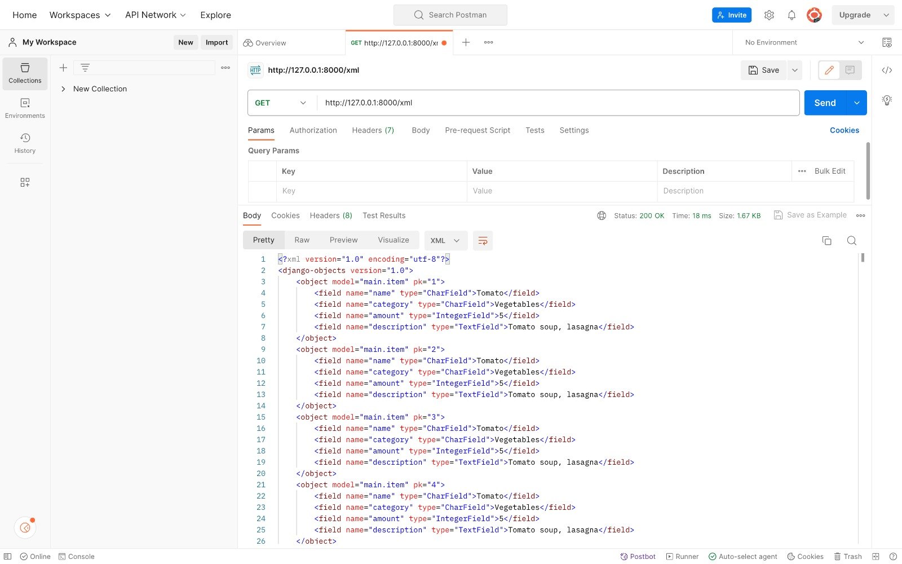
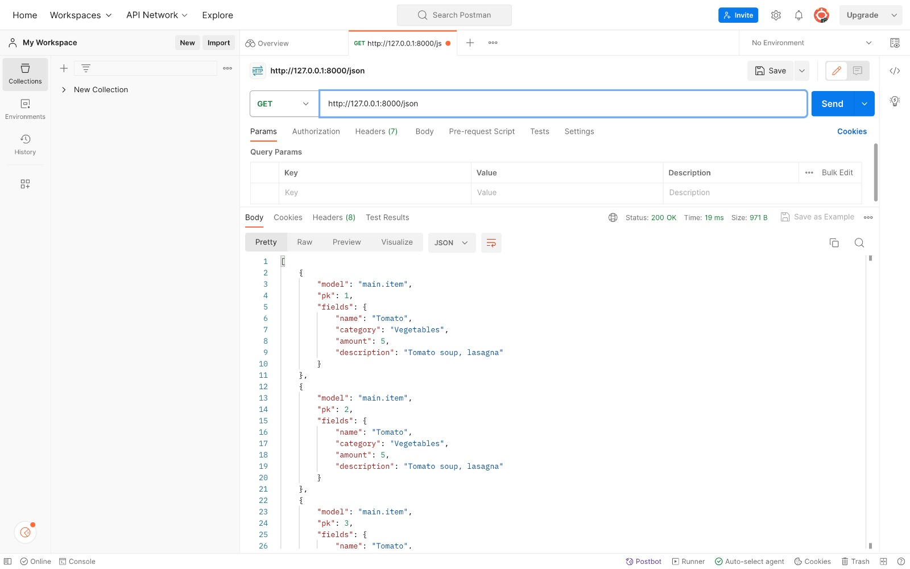
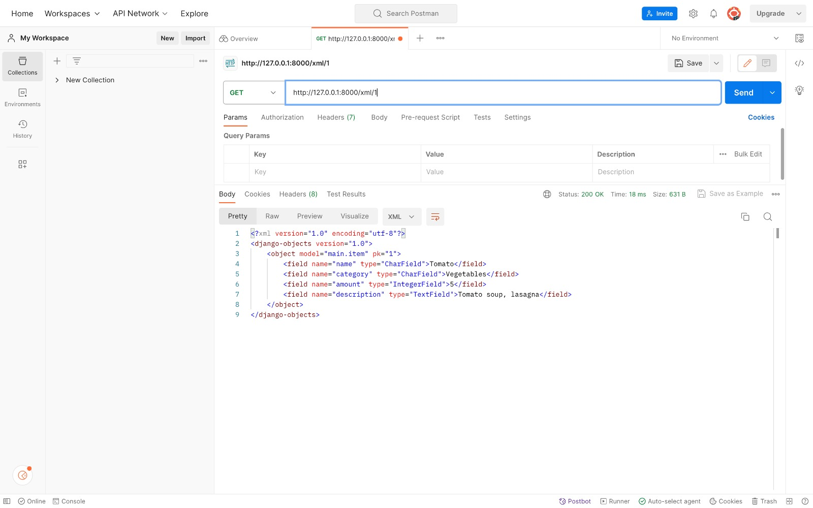
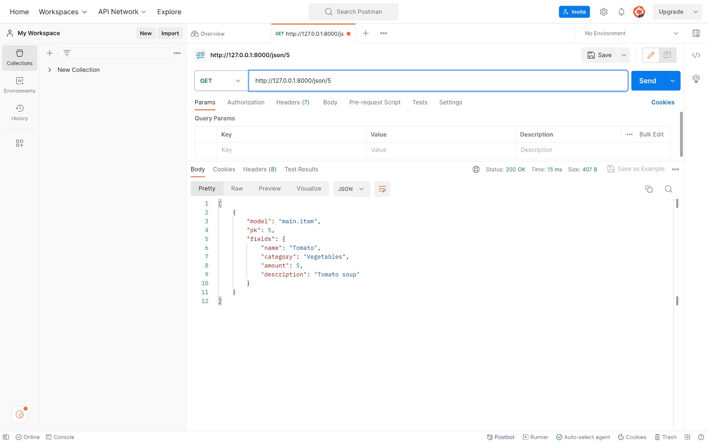
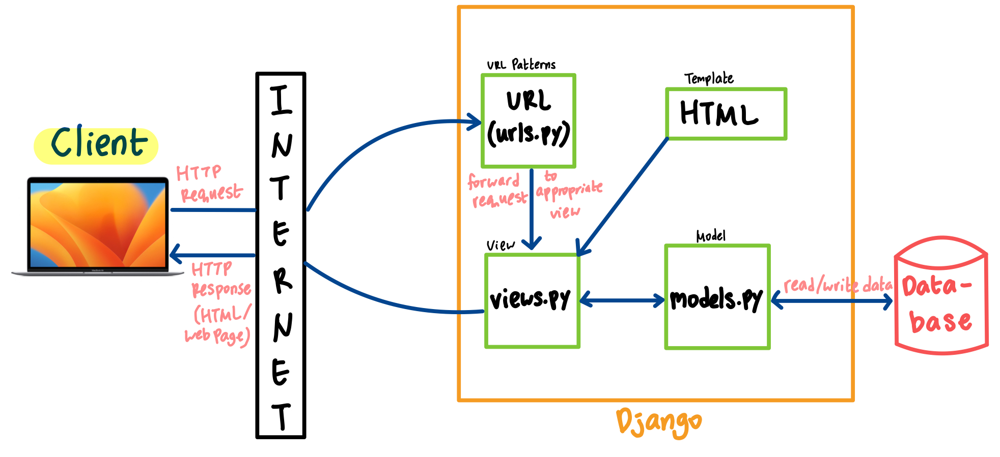

[Link Adaptable](https://ingredients-collection-app.adaptable.app/main/) tidak bisa diakses karena akun Adaptable saya di-disabled 
# Tugas 3 PBP
# Penjelasan Implementasi Checklist
## Checklist 1: Membuat Input `form` 
## Checklist 2: Menambahkan Lima Fungsi `views`
## Checklist 3: Membuat *Routing* URL untuk Masing-Masing `views`
# Perbedaan antara Form `POST` dan `GET` dalam Django
* *Method* `POST` pada form Django digunakan untuk menambahkan data ke *server*. Ketika *client* men-*submit* data ke suatu server, proses tersebut menggunakan *method* `POST`.
* *Method* `GET` pada form Django digunakan untuk mendapatkan data dari *server*. *Method* ini merupakan *default method* yang digunakan ketika kita membuat *form* di Django. *Client* mengirimkan HTTP *request* ke suatu *server* lalu *server* tersebut akan mengirimkan HTTP *response* berupa HTML atau *web page*. Di saat yang bersamaan, *client* juga akan mengirimkan (*passing*) data ke *server* tersebut, contohnya adalah men-*submit* data di *form*. Kemudian, *server* tersebut akan mengumpulkan data yang telah di-*submit* menjadi kumpulan *string* lalu digabungkan menjadi suatu URL (yang menyimpan *key* dan *value* dari data yang di-*submit*) dan menjadi HTTP *response*.
* Perbedaan antara kedua *methods* untuk form tersebut terletak pada URL di *address bar* yang ditampilkan oleh *server* ketika *client* selesai mengisi *form*. Pada *server* yang menggunakan *method* `GET`, data yang di-*pass* oleh *client* akan muncul di URL. Contohnya adalah sebagai berikut: Laras, seorang *client*, mengisi sebuah *form* tentang data dirinya, yaitu `nama lengkap`, `NPM`, serta `nama angkatan`. Setelah mengisi *form*, URL di *address bar* pada *browser* yang Laras gunakan untuk *form* tersebut akan berbentuk seperti ini: `http://form_yang_diisi_laras/submit?nama=TengkuLarasMalahayati&NPM=2206081641&namaangkatan=Apollo`. Kita dapat melihat bahwa data pribadi Laras tertera pada URL. Oleh karena itu, *method* `GET` kurang cocok untuk digunakan pada *form* yang mengharuskan *client* untuk mengirimkan data pribadi, seperti nomor telepon, *username*, *password*, alamat rumah, dan lain-lain.
* Sebaliknya pada *form* yang menggunakan *method* `POST`, tampilan URL di *address bar* Laras adalah: `http://form_yang_diisi_laras/submit`. Data pribadi Laras tidak tertera pada URL. Akan tetapi, URL-nya menjadi kurang cocok untuk di-*bookmark* karena URL-nya tidak memiliki informasi detail yang membedakannya dengan URL dari *client* lain yang juga men-*submit form* tersebut.
# Perbedaan utama antara XML, JSON, dan HTML dalam Konteks Pengiriman Data
Perbedaan utama antara XML, JSON, dan HTML dalam pengiriman data terletak pada struktur data yang dikirim. Berikut adalah penjelasannya:
* XML (eXtensible Markup Language) adalah sebuah *markup language* yang berfungsi untuk menyimpan dan mengirim data. Data disusun dalam struktur *tree* (pohon) secara berlapis-lapis (ber-*layer*). XML juga menggunakan *tag* yang dapat *programmer* tentukan sendiri untuk setiap elemen datanya. Penggunaan *tag* pada XML membuat data yang dikirim selama pengiriman data menjadi lebih kompleks.
* JSON (Javascript Object Nation) adalah sebuah  
# Mengapa JSON Sering Digunakan dalam Pertukaran Data antara Aplikasi Web Modern?
JSON sering digunakan dalam pertukaran data antara aplikasi web modern karena format pengiriman data ini bersifat universal (dapat digunakan di bahasa pemograman apapun). Selain itu, struktur datanya yang berupa *key*-*value pairs* (seperti *dictionary*) membuatnya dapat dibaca oleh mesin (*machine readable*) dan manusia (*human readable*), sehingga lebih mudah untuk dipahami ketika kita menerima data dalam bentuk JSON. Selain itu, JSON menggunakan memori yang lebih sedikit dibanding XML sehingga lebih *lightweight* (ringan) ketika digunakan dalam pengiriman data.
# *Screenshot* Hasil Akses URL menggunakan Postman
### HTML
### XML

### JSON

### XML by ID

### JSON by ID

-----------------------------------------------------------------------------------------------------------------------------------------------------------------------------------
# Tugas 2 PBP
# Penjelasan tentang Aplikasi Pengelolaan yang Saya Buat
Aplikasi pengelolaan yang saya buat terinspirasi dari *mobile game* Adorable Home, yang merupakan sebuah *game* simulasi.
Pada awal permainan, pengguna akan diminta untuk memilih seorang pasangan dan menempati sebuah rumah virtual dengan seekor kucing.
Selama permainan, pengguna akan mengelola rumah virtual tersebut bersama pasangannya.
Terdapat berbagai kegiatan yang dapat dilakukan pengguna selama bermain, salah satunya adalah memasak.
Aplikasi ini bertujuan untuk menyimpan banyak bahan makanan yang akan dibutuhkan untuk memasak serta membaginya menjadi beberapa kategori, seperti `fruits`, `meat`, dan `vegetables`.

# Penjelasan Implementasi Checklist
## Checklist 1 : Membuat Sebuah Proyek Django
### Step 1: Membuat Direktori Utama Proyek dan Mengaktifkan *Virtual Environment*
Sebelum membuat sebuah proyek Django untuk aplikasi saya, saya membuat sebuah direktori baru bernama `ingredients_collection` yang menjadi direktori utama pembuatan aplikasinya.
Setelah itu, saya mengaktifkan *virtual environment* di perangkat saya dengan *command*:
```
python -m venv env
```
dan 
```
source env/bin/activate
```
### Step 2: Melakukan *Setup Library* yang Dibutuhkan
Selanjutnya, saya membuat sebuah *file* bernama `requirements.txt` yang berisi beberapa *dependencies* (komponen-komponen yang diperlukan oleh perangkat lunak kita untuk berfungsi yang berisi *library*, *framework*, maupun *package*). Tanpa *dependencies*, perangkat lunak kita tidak akan berjalan semestinya. Isi dari `requirements.txt` adalah sebagai berikut:
```
django
gunicorn
whitenoise
psycopg2-binary
requests
urllib3
```
Kemudian, *dependencies* akan dipasang dengan *command* berikut: 
```
pip install -r requirements.txt
```
### Step 3: Membuat Proyek `ingredients_collection`
Selanjutnya, saya membuat proyek Django yang bernama `ingredients_collection` dengan *command* berikut:
```
django-admin startproject ingredients_collection .
```
## Checklist 2: Membuat Aplikasi dengan Nama `main` dalam Proyek
Pada direktori proyek Django yang bernama `ingredients_collection`, saya membuat sebuah aplikasi bernama `main` dengan *command* berikut:
```
python manage.py startapp main
```
Aplikasi `main` terbentuk menjadi sebuah *folder* baru yang berisi *source codes* yang dibutuhkan untuk membuat aplikasi saya. 
## Checklist 3: Melakukan Routing pada Proyek
Selanjutnya, saya mendaftarkan aplikasi `main` dalam proyek dengan menambahkan `main` ke daftar aplikasi yang ada pada *file* `settings.py`. 
```
INSTALLED_APPS = [
    'main',
    'django.contrib.admin',
    'django.contrib.auth',
    'django.contrib.contenttypes',
    'django.contrib.sessions',
    'django.contrib.messages',
    'django.contrib.staticfiles',
]
```
## Checklist 4: Membuat Model pada Aplikasi `main` dengan Nama `Item`
### Step 1: Membuat Model `Item`
Model merupakan sumber data pada aplikasi yang akan kita buat. Model juga merupakan tempat penyimpanan yang menjadi *database* dari aplikasi kita karena menyimpan data-data yang bersesuaian dengan atribut yang telah kita tetapkan. Pada aplikasi ini, saya membuat sebuah model bernama `Item` yang memiliki empat atribut, yaitu `name`, `category`, `amount`, dan `description`.
```
from django.db import models

class Item(models.Model): 
    name = models.CharField(max_length=100) 
    category = models.CharField(max_length= 50, default = 'Uncategorized') 
    amount = models.IntegerField() 
    description = models.TextField() 
```
Setiap model merupakan Python class yang merupakan subclass dari `django.db.models.Model`. Setiap atribut pada model merepresentasikan sebuah *database*. Pada aplikasi saya, atribut-atribut yang saya buat memiliki kegunaan sebagai berikut:
* `name` berfungsi untuk menyimpan nama dari suatu bahan makanan.
* `category` berfungsi untuk menyimpan kategori dari suatu bahan makanan, misalnya 'strawberry' termasuk dalam kategori 'fruits'. *Default value* dari atribut ini adalah 'Uncategorized'.
* `amount` berfungsi untuk menyimpan banyak suatu bahan makanan.
* `description` berfungsi untuk menyimpan jenis-jenis makanan yang dapat dibuat dari suatu bahan makanan. Misalnya, dengan 'strawberry' kita dapat membuat 'strawberry pie'.
### Step 2: Melakukan Migrasi Model `Item`
Migrasi model dilakukan agar Django dapat melacak perubahan yang terjadi pada *database*, misalnya penambahan atribut. Saya melakukan migrasi setelah saya selesai menambahkan atribut-atribut pada model `Item` dengan *command* berikut:
```
python manage.py makemigrations
```
dan 
```
python manage.py migrate
```
## Checklist 5: Membuat Sebuah Fungsi pada `views.py`
### Step 1: Mengimpor Fungsi *render* dari Modul `django.shortcuts`
Pada *file* `views.py` yang terletak di dalam *folder* aplikasi `main`, saya menambahkan baris impor fungsi berikut:
```
from django.shortcuts import render
```
Fungsi *render* dibutuhkan untuk menghubungkan `view` dengan `template` menggunakan Django. Dengan fungsi *render*, fungsi yang akan kita buat dapat mengembalikan sebuah *template* HTML dan menampilkan nama beserta kelas kita saat aplikasi dijalankan.
### Step 2: Membuat Fungsi `show_main` yang Dapat Mengembalikan *Template* HTML dan Menampilkan Data
```
def show_main(request):
    context = {
        'name': 'Tengku Laras Malahayati',
        'class': 'PBP D'
    }
    return render(request, "main.html", context)
```
* Fungsi `show_main` akan mengembalikan sebuah *template* HTML dan menampilkan data nama beserta kelas saya.
### Step 3: Membuat *Template* HTML
Saya membuat sebuah *file* HTML bernama `main.html` dalam *folder* `main`. Isi dari *file* tersebut adalah sebagai berikut:
```
<head>
<title> Adorable Home's Ingredients Collection Page</title>
</head>

<h1>Adorable Home's Ingredients Collection Page</h1>

<h5>Name: </h5>
<p>{{ name }}</p> 
<h5>Class: </h5>
<p>{{ class }}</p> 
```
* *title* dari tampilan aplikasi saya adalah Adorable Home's Ingredients Collection Page.
* {{ name }} dan {{ class }} berfungsi untuk menampilkan nilai dari variabel `name` dan `class` yang telah didefinisikan pada `context` di fungsi `show_main`.
## Checklist 6: Membuat Sebuah *Routing* pada `urls.py` Aplikasi `main`
### Step 1: Mengizinkan Akses agar Tautan Aplikasi dapat Diakses secara Luas
Saya mengizinkan akses agar semua *host* dapat mengakses tautan aplikasi `main` dengan menambahkan *key* `"*"` pada variabel `ALLOWED_HOSTS`. Hal ini memungkinkan aplikasi `main` dapat diakses oleh publik. 
```
ALLOWED_HOSTS = ["*"]
```
### Step 2: Mengonfigurasi *Routing* URL pada Aplikasi `main`
Rute URL untuk aplikasi `main` akan diatur oleh sebuah *file* yang bernama `urls.py` yang terletak di dalam *folder* `main`. *File* tersebut akan diisi dengan serangkaian kode yang bertugas untuk mendefinisikan pola URL, mengatur tampilan yang akan ditampilkan ketika URL diakses, serta memberikan nama unik pada pola URL dalam aplikasi.
```
from django.urls import path
from main.views import show_main

app_name = 'main'

urlpatterns = [
    path('', show_main, name='show_main'),
]
```
### Step 3: Mengonfigurasi *Routing* URL pada Proyek `ingredients_collection` dan Menghubungkannya dengan Aplikasi `main`
Rute URL untuk proyek `ingredients_collection` diatur oleh sebuah file yang bernama `urls.py` yang terletak di dalam *folder* proyek `ingredients_collection`. *File* tersebut akan diisi dengan serangkaian kode yang bertugas untuk mengimpor rute URL dari `main` ke proyek dan mengarahkan URL ke rute yang telah didefinisikan di `main`.
```
from django.contrib import admin
from django.urls import path, include

urlpatterns = [
    path('main/', include('main.urls')),
    path('admin/', admin.site.urls),
]
```
### Step 4: Menjalankan Proyek Django 
Jalankan proyek Django dengan *command* berikut:
```
python manage.py runserver
```
dan buka tautan http://127.0.0.1:8000/ untuk melihat halaman aplikasi yang telah dibuat.  
## Checklist 7: Melakukan *Deployment* ke Adaptable terhadap Aplikasi yang Sudah Dibuat
Saya membuat sebuah *public repository* di GitHub bernama `ingredients_collection` untuk proyek aplikasi ini. Lalu, saya menghubungkan *repository* tersebut dengan Adaptable.io. Saya menggunakan `Python App Template` sebagai *template deployment* karena aplikasi `main` saya kembangkan menggunakan bahasa pemograman Python. Selain itu, saya menggunakan `PostgreSQL` sebagai tipe *database* yang digunakan. Selanjutnya, saya memasukkan perintah 
```
python manage.py migrate && gunicorn ingredients_collection.wsgi
```
pada bagian `Start Command`. Kemudian, saya memasukkan nama aplikasi yaitu `ingredients-collection-app` lalu mencentang bagian `HTTP Listener on PORT` dan memulai proses *deployment*.
# Bagan *Request Client* ke Web Aplikasi Berbasis Django

* *Client* mengirimkan HTTP *request* pada Internet/*web browser* yang kemudian akan diteruskan ke Django.
* Django akan mencari pola URL yang bersesuaian dengan HTTP *request* yang diminta *client* pada `urls.py`.
* Setelah ditemukan, Django akan memanggil fungsi pada `views.py` yang bersesuaian dengan pola URL yang diminta.
* Kemudian, fungsi pada `views.py` akan mengakses `models.py` yang berisi data yang bersesuaian dari *database*.
* Setelah mendapatkan data yang dibutuhkan, `views.py` mengembalikan *request* dari *client* dalam bentuk HTML/*webpage* yang diakses dari berkas HTML pada `template`. 
# Mengapa Kita Menggunakan *Virtual Environment*?
*Virtual environment* adalah sebuah ruang/lingkungan virtual yang terpisah dari sistem yang kita miliki. Pada proyek aplikasi ini, kita menggunakan Python *virtual environment*, yaitu sebuah ruang virtual yang mengelola sebuah *environment* terpisah untuk setiap proyek Python yang kita buat. Penggunaan *virtual environment* memungkinkan kita sebagai *programmer* untuk mengisolasi dependensi proyek-proyek Python kita dan memastikan tidak ada konflik ketika ada perbedaan versi *library* atau *package*. Dengan menggunakan *virtual environment*, kita dapat mengunduh Python dengan versi yang berbeda serta *dependencies* lainnya untuk setiap proyek tanpa konflik *dependencies*. *Virtual environment* juga memungkinkan kita untuk menghindari permasalahan yang mungkin dapat terjadi ketika proyek yang kita buat dijalankan di *hardware* yang memiliki sistem operasi yang berbeda. 
# Apakah Kita Tetap Dapat Membuat Aplikasi Web Berbasis Django Tanpa Menggunakan *Virtual Environment*?
Kita tetap dapat membuat aplikasi web berbasis Django tanpa menggunakan *virtual environment*, asalkan kita telah memastikan bahwa tidak akan terjadi *dependencies conflict* pada aplikasi kita, tetapi hal ini tidak dianjurkan. Mengapa? Karena mungkin tanpa adanya *virtual environment*, kita harus mengunduh paket Python dan *dependencies* secara global di perangkat kita. Hal tersebut berpotensi menciptakan masalah seperti konflik antara versi Python yang berbeda antarproyek, kesulitan dalam mengatur *dependencies*, hingga masalah keamanan karena sistemnya tidak terisolasi. Kita juga akan lebih sulit untuk berkolaborasi dengan pihak lain dalam mengembangkan aplikasi kita karena mereka akan mengalami kesulitan dalam membuat *environment* yang sama dengan perangkat yang kita gunakan.
# MVC, MVT, MVVM, serta Perbedaannya
## MVC
* MVC (Model-View-Controller) adalah sebuah konsep desain dalam pengembangan perangkat lunak yang memisahkan berbagai aspek atau tanggung jawab dari aplikasi ke tiga komponen, yaitu `Model`, `View`, dan `Controller`.
* `Model` berperan sebagai bagian yang mengatur serta memanipulasi data yang ada di *database* aplikasi
* `View` berperan sebagai bagian yang menampilkan data yang ada pada `Model` kepada pengguna (*user*)
* `Controller` berperan sebagai bagian yang mengatur alur pergerakan data ke `Model` dan menghubungkannya dengan `View`. Akan tetapi, *programmer* harus membuat kode yang akan mengatur interaksi antara `Model` dengan `View`.

## MVT
* MVT (Model-View-Template) adalah sebuah konsep desain dalam pengembangan perangkat lunak yang memisahkan berbagai aspek atau tanggung jawab dari aplikasi ke tiga komponen, yaitu `Model`, `View`, dan `Template`.
* Arsitektur MVT memiliki *pattern design* yang mirip dengan arsitektur MVC, tetapi pada MVT *programmer* tidak perlu membuat kode yang mengatur interaksi `Model` dengan `View` karena bagian tersebut telah diatur oleh *framework*, sehingga *programmer* hanya perlu membuat *template*.
* Salah satu *framework* yang menggunakan arsitektur ini adalah Django yang kita gunakan untuk mengerjakan tugas ini.

## MVVM 
* MVVM (Model-View-Viewmodel) adalah sebuah konsep desain dalam pengembangan perangkat lunak yang memisahkan berbagai aspek atau tanggung jawab dari aplikasi ke tiga komponen, yaitu `Model`, `View`, dan `Viewmodel`.
* Arsitektur ini mirip dengan MVC, tetapi pada MVC `View` memiliki peran yang berhubungan dengan `Model`, sedangkan pada MVVM `View` tidak dapat mendeteksi keberadaan `Model`. Oleh karena itu, komunikasi antara `View` dengan `Model` harus melalui `Viewmodel`. Ketika terjadi perubahan pada `Model`, `Viewmodel` memberikan notifikasi perubahan kepada `View`.
* Komunikasi antara `View` dan `Viewmodel` berlaku dua arah.

## Perbedaan MVC, MVT, dan MVVM
* Perbedaan ketiga konsep desain tersebut terletak pada jembatan penghubung antar komponen-komponennya. Pada MVC, `Controller` berperan sebagai penghubung `Model` dan `View`, sedangkan `Template` pada MVT dan `Viewmodel` pada MVVM menjadi "Controller"-nya.
* Selain itu, pada MVC dan MVT `Model` dan `View` terhubung secara langsung. Namun, pada MVVM mereka harus melalui `Viewmodel` karena `Model` dan `View`nya tidak terhubung secara langsung.
